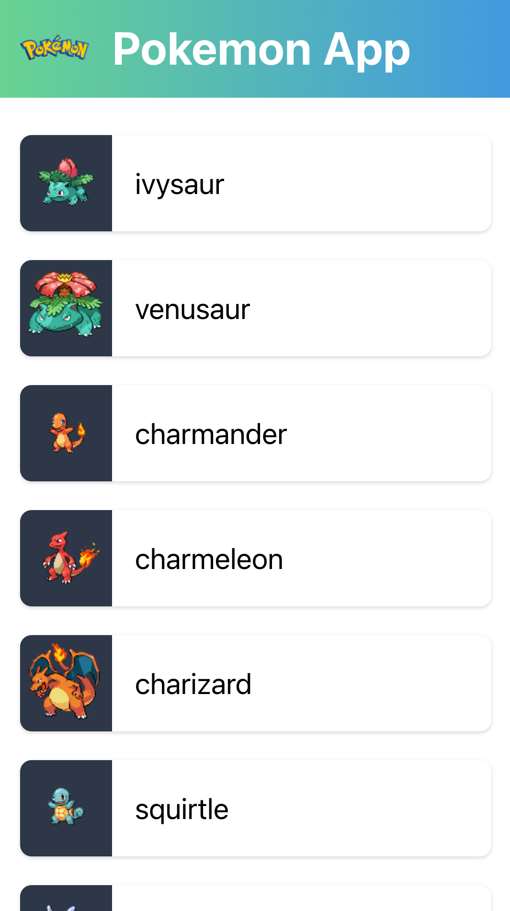

# testing-vuenuxt-playground

> 🕺 Code to show how we can easily add unit test into our Vue and Nuxt project

[](https://github.com/mazipan/testing-vuenuxt-playground/actions/workflows/testing.yml)

## Workspace managed by `pnpm`

Install dependencies:

```bash
$ pnpm install
```

## Applications

## 📸 Screenshots



### 🟩 Nuxt 2 Project (Bootstrapped w create-nuxt-app)

Run test script:

```bash
$ pnpm run test:nuxt2
```

Run app in local:

```bash
$ pnpm run test:nuxt2
```

### 🟩 Vue 2 Project (Bootstrapped w Vue-CLI)

Run test script:

```bash
$ pnpm run test:vue2
```

Run app in local:

```bash
$ pnpm run test:vue2
```

### 🟩 Vue 3 Project (Bootstrapped w Vite)

Run test script:

```bash
$ pnpm run test:vue3
```

Run app in local:

```bash
$ pnpm run test:vue3
```

------

Copyright © 2020-present by Irfan Maulana
